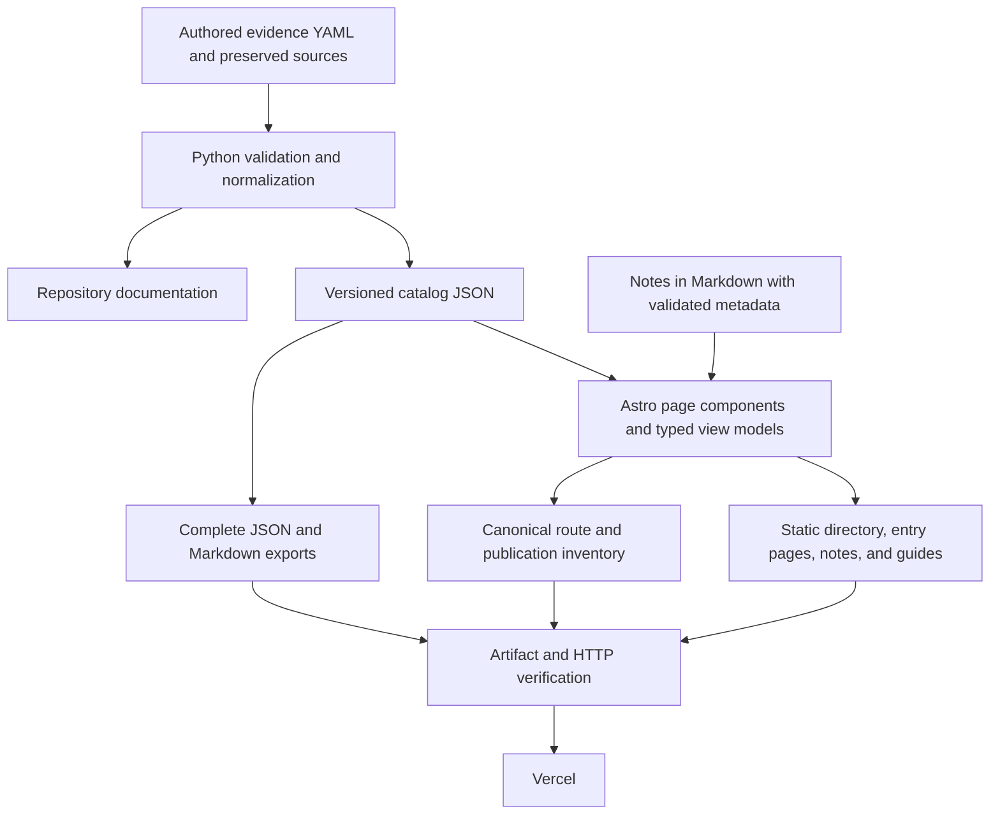

# Plan 006: Publish discoverable entry pages on Astro

> **Proposal, not implementation authorization.** This plan answers the request to
> give every catalog entry a useful, discoverable page and improve the website's
> maintainability. It was prepared against commit `48269f7` on 2026-09-14.
>
> **Executor instructions:** Read the full plan before editing. Implement the
> steps in order, preserve the evidence contracts, and run the verification gates.
> Record the completion evidence in this file and update `plans/README.md` when
> the implementation is complete. A reviewer may retain ownership of that index.
>
> **Drift check:** Run `git diff --stat 48269f7..HEAD -- scripts tests templates
> data docs .github package.json package-lock.json pyproject.toml uv.lock
> middleware.ts routing-manifest.json vercel.json site .gitignore` and compare any
> changed areas with the current-state excerpts below. Reconcile meaningful drift
> before implementation; do not overwrite work from another contributor.

## Recommendation

Use **Astro with TypeScript and static output for the website**, keep **Python
and YAML for evidence validation and normalization**, and continue hosting on
**Vercel at internal-agents.com**. Keep npm and uv as the package managers.

This is a bounded replacement of the website renderer. Python remains responsible
for research rules, archive verification, the normalized catalog, and generated
repository documentation. Astro owns page components, routes, styling, assets,
and the website's reading experience. The existing Markdown and JSON interfaces
remain supported.

The initial authoring assumption is repository edits and pull requests. A CMS can
later feed the same validated content boundary; accounts, a database, and a CMS
are not prerequisites for entry pages.

| Option | Fit for this repository | Decision |
| --- | --- | --- |
| Extend Python with reusable HTML templates | Smallest implementation change; enough to create indexable pages. Publication and frontend tooling would remain largely custom. | Sensible fallback if the only goal becomes shipping URLs quickly. |
| Astro + TypeScript, retaining Python validation | Fits a researched directory plus explanatory articles. Provides reusable page components, static route generation, and validated content collections. | Recommended for the requested flexibility and maintenance improvements. |
| Next.js | Can also export static HTML. Its application capabilities become more valuable with authenticated or personalized workflows. | Reconsider if those workflows become concrete requirements. |

The framework itself does not improve ranking. The search benefit comes from
useful individual documents, crawlable links, consistent URLs, and clear content.
Astro's [static routing](https://docs.astro.build/en/guides/routing/),
[content collections](https://docs.astro.build/en/guides/content-collections/), and
[Vercel deployment support](https://docs.astro.build/en/guides/deploy/vercel/) fit
this architecture. Next.js also supports
[static exports](https://nextjs.org/docs/app/guides/static-exports).

## Status and sizing

- **Priority:** P1
- **Effort:** L; approximately 6–10 focused engineering days, plus editorial and
  design review. This is an estimate, not a delivery commitment.
- **Risk:** Medium. The main risks are delivery compatibility, evidence loss in
  a cleaner presentation, and tests that currently assume everything is on `/`.
- **Depends on:** Plans 004 and 005, both complete. Plan 005 defined the
  delivery contracts that this plan preserves.
- **Category:** Direction / migration.
- **Planned at:** `48269f7`, 2026-09-14.
- **Implementation status:** TODO.

Suggested sequence: establish contracts and a three-entry preview; port shared
pages; complete entries, exports, and discovery; validate and cut over. Keep the
migration on a feature branch until the replacement passes the full contract.
Production deploys automatically from `main`.

## What success means

1. Every eligible catalog implementation has a useful page such as
   `https://internal-agents.com/agents/block-builderbot`.
2. The directory provides short summaries and ordinary links to those pages.
3. A visitor arriving directly from search can understand the system, follow the
   sources, and find relevant notes without first reading the homepage.
4. All existing evidence, qualifications, relationships, and export interfaces
   remain available. The presentation becomes easier to read.
5. Adding an entry does not require editing route lists, page templates, sitemap
   entries, or hosting headers by hand.
6. Adding an article uses a content file and shared layout. A fresh checkout has
   documented commands for preview, build, and verification.

## Current state and confirmed baseline

The repository has 39 implementations across 35 organizations, 555 normalized
claims, and 88 sources. There are 11 indexable HTML documents: the directory,
Definitions, Methodology, Notes index, and seven notes. Entry exports exist as
Markdown and JSON, but entries have no separate HTML documents.

Read-only verification on 2026-09-14 passed:

- `uv run --no-sync --locked python -B scripts/build.py --check`
- `uv run --no-sync --locked python -B scripts/check_site.py --root site`
- `uv run --no-sync --locked python -B -m unittest discover -s tests`: 125 tests.
- `node --test tests/negotiation.test.mjs`: 3 tests.

The local working tree was clean. The generated homepage is 794,850 bytes before
compression. This is a size observation, not a measured page-speed result.
Planning covered the data/publication boundary, routes, tests, and representative
content. It did not include a full security, dependency, accessibility, or search
performance audit.

### Files and load-bearing excerpts

- `scripts/build.py` is 1,990 lines. It validates YAML and archives, normalizes
  data, renders repository Markdown and website HTML, hashes assets, and generates
  discovery files and Vercel configuration.
- `scripts/archive_sources.py` preserves and validates accepted sources.
- `data/agents/*.yaml` is authored research. `data/agents.json` is generated
  schema-version-4 output. Archive material is repository-only.
- `templates/site.html`, `templates/site.css`, and `templates/site.js` define the
  website shell and directory. `templates/notes/*.html` contains the seven notes.
- `scripts/check_site.py` checks publication boundaries, coverage, links, and
  privacy. Its current output allowlist and coverage checks assume a single
  complete catalog page.
- `tests/test_build.py` covers evidence normalization. `tests/test_site.py` and
  `tests/test_publication.py` currently call Python renderers directly.
- `middleware.ts`, `scripts/negotiation.mjs`, and `routing-manifest.json` preserve
  HTML/Markdown content negotiation and canonical-host redirects.
- `scripts/check_delivery.py` verifies deployed status, response bytes, MIME,
  caching, and negotiation. It currently assumes physical HTML names equal URL
  paths and reads the hand-built asset manifest.
- `.github/workflows/validate.yml` checks committed generated outputs without
  rebuilding them first. Its Actions are pinned to commit SHAs.
- `docs/site.md` documents Vercel correctly; the end of `CONTRIBUTING.md` still
  mentions GitHub Pages and must be reconciled during this migration.

`scripts/build.py:1118–1145` derives claim identity from existing field paths:

```python
claim_id = f"{record['id']}--{path.replace('.', '-').replace('_', '-')}"
claim = {
    "id": claim_id,
    "approach_id": record["id"],
    "field": path,
    "text": claim_text,
    # kind, provenance, confidence, dates, and evidence follow
}
```

Keep these identities. Reordering metric or lesson arrays can change the meaning
of an existing positional claim ID; avoid that during the migration.

`scripts/build.py:1370–1383` currently places the full record inside a directory
disclosure and produces a fragment permalink:

```text
f'<details><summary>Operating model, claims &amp; sources</summary><div class="entry-body">'
f"<h4>Scoped operating models</h4>{model_html}{group_html}"
f'<h4>Sources</h4><ol class="sources">{"".join(source_html)}</ol></div></details>'
# ...
link('#' + approach['id'], 'Permalink ↗', ...)
```

`scripts/build.py:1801–1820` obtains record Markdown by parsing the homepage and
puts fragment URLs in the compact index:

```python
entry = parsed_catalog.find(attrs={"data-approach-id": key})
entry.find("h3").name = "h1"
outputs[site / f"agents/{key}.md"] = page_markdown(str(entry), ORIGIN + "/#" + key)
# ...
"url": ORIGIN + "/#" + key,
```

`templates/vercel.json` currently blocks indexing of every path under `/agents`:

```json
{
  "source": "/agents/:path*",
  "headers": [{ "key": "X-Robots-Tag", "value": "noindex" }]
}
```

`middleware.ts:5` matches only the homepage and `.html` routes:

```ts
export const config = { matcher: ['/', '/:path*.html'] };
```

`scripts/check_site.py:143–157` requires all approach, claim, and source IDs, and
every claim's text, in `index.html`. Replace this with directory coverage plus
per-entry coverage, rather than removing the coverage requirement.

## Target architecture



### Ownership boundaries

- **Python:** Keep the existing research validation and normalization semantics.
  Introduce a data-only output function and CLI mode before removing website
  rendering. Once Astro replaces the site, `scripts/build.py` becomes the data
  and repository-doc build command. Extract HTML/publication functions out of its
  responsibilities; avoid a simultaneous wholesale rewrite of the validators.
- **TypeScript:** Validate the structural contract consumed by the website,
  resolve claim/source references, and construct presentation models. Python
  remains authoritative for evidence rules. Do not reimplement archive integrity,
  inclusion policy, or confidence inference in a second language.
- **Astro:** Generate static HTML and static export endpoints. Use ordinary
  components and local CSS, with small scripts for filters and legacy links.
  The catalog JSON and research processing stay out of browser bundles.
- **Content collections:** Use them for notes and content metadata. Entries can
  load the normalized catalog through one typed module; avoid loading the raw
  research YAML separately in Astro. No second editable copy of the factual data.
- **Vercel:** Continue serving static output and the small existing routing
  middleware. Static Astro pages do not require an SSR adapter. Retain middleware
  for the already supported negotiation behavior and verify it in a deployment.

The ongoing cost is maintaining Python and Node toolchains and a small development
bridge between them. Both runtimes already exist in this repository. Keep that
bridge narrow and documented; the migration is worthwhile because it removes
custom frontend rendering and publication responsibilities as page types grow.

At planning time `npm view astro version engines --json` returned Astro `7.3.2`
and a minimum Node version of `22.12.0`. Check the stable package and compatible
integrations at execution time and commit exact resolutions in the lockfile.
Choose a supported Node LTS release consistently for development, CI, and Vercel;
the planning machine's Node `26.4.0` is not a deployment-version specification.

### Proposed file layout

```text
data/agents/*.yaml                 authored evidence, unchanged format
data/agents.json                   committed normalized contract
scripts/build.py                  Python data and repository-doc build
src/content/notes/*.md             articles, metadata, existing diagrams
src/content.config.ts             note collection and metadata schema
src/lib/catalog.ts                typed catalog loading and reference resolution
src/lib/entry-view.ts              shared reading/export model
src/lib/routes.ts                  canonical path helpers and route inventory
src/lib/metadata.ts                metadata and structured-data helpers
src/lib/exports.ts                 comprehensive record/catalog Markdown
src/layouts/SiteLayout.astro
src/layouts/ArticleLayout.astro
src/components/AgentCard.astro
src/components/AgentDetail.astro
src/components/Citation.astro
src/components/ResearchDetails.astro
src/components/RelatedContent.astro
src/pages/index.astro
src/pages/agents/[id].astro
src/pages/agents/[id].json.ts
src/pages/agents/[id].md.ts
src/pages/agents/index.json.ts
src/pages/agents.json.ts
src/pages/notes/index.astro
src/pages/notes/[slug].astro
src/pages/notes/[slug].md.ts
src/pages/definitions.astro
src/pages/methodology.astro
src/pages/404.astro
src/pages/robots.txt.ts
src/pages/sitemap.xml.ts
src/pages/llms.txt.ts
src/pages/index.md.ts              comprehensive catalog, retained interface
src/pages/notes.md.ts
src/pages/definitions.md.ts
src/pages/methodology.md.ts
src/pages/data-guide.md.ts
src/styles/                       existing design tokens, layout, components
src/assets/                       Geist font and bundled visual assets
public/                           explicitly approved static assets only
scripts/site-publication.ts        route/export inventory and final artifact checks
scripts/dev-catalog.ts             serialized YAML rebuilds during local preview
tests/web/                        TypeScript contract/unit tests
tests/e2e/                        browser acceptance tests
astro.config.mjs
tsconfig.json
playwright.config.ts
vitest.config.ts
routing-manifest.json              small generated middleware input
vercel.json                        authored hosting policy, no per-entry edits
dist/                             generated site, ignored by Git
```

The layout is a responsibility map. Small components may be combined when they
have no independent behavior. Do not create a generic plugin framework or add a
client component library solely to render these pages.

Use `output: 'static'`, `build.format: 'file'`, and `trailingSlash: 'never'` in
Astro. Set Vercel `cleanUrls: true` and `trailingSlash: false`. This produces files
such as `dist/agents/block-builderbot.html` at clean public URLs. The same policy
applies to the existing guides and notes. Vercel documents automatic permanent
redirects from `.html` URLs with
[`cleanUrls`](https://vercel.com/docs/project-configuration/vercel-json#cleanurls).

## URL and compatibility contract

Use existing approach IDs as stable public slugs. A page represents one
implementation, so multiple implementations at DoorDash, Plaid, or Uber remain
separate. Company-name changes must not silently rename published URLs. Explicit
redirect mappings can handle a future necessary rename; display aliases are not
automatically URL aliases.

| Request or interface | Required behavior |
| --- | --- |
| `/` | Searchable directory with all 39 summary cards and crawlable entry links in its initial HTML. |
| `/agents/block-builderbot` | HTTP 200, complete entry HTML, self-canonical, indexable. |
| `/agents/block-builderbot.html` or trailing-slash variant | Permanent redirect to the canonical extensionless entry URL. |
| `/#block-builderbot` | Known legacy fragment resolves to the entry; without JS, its directory card remains an anchor and links to the entry. |
| `/#claim-<existing-claim-id>` and `/#source-<existing-source-id>` | Known fragments resolve to the containing entry and the same anchor there. Maintain a directory fallback for no-JS navigation. |
| `/#catalog`, `/#main`, unrecognized fragments | Preserve ordinary homepage behavior; never interpret an arbitrary fragment as a redirect destination. |
| `/definitions.html`, `/methodology.html`, `/notes.html`, `/notes/<slug>.html` | Permanent redirects to the corresponding extensionless page, preserving query strings and browser fragment behavior. |
| `/index.html` | Permanent redirect to `/`; test rather than assuming the host handles this special case. |
| `/agents/<id>.json` | Same schema-version-4 record interface and complete evidence. Correct MIME and current CORS behavior. Intentionally excluded from indexing. |
| `/agents/<id>.md` | Complete evidence-readable record, with original citations and qualifications. HTTP canonical link points to its HTML page. |
| `/agents/index.json` | Same compact-index interface; `url` now points to the entry HTML page. Export URLs remain unchanged. |
| `/agents.json`, `/index.md`, `/data-guide.md`, `/llms.txt`, existing note/guide Markdown | Preserve documented access and completeness. Never shrink the comprehensive catalog export to directory-card text. |
| Canonical HTML URL with `Accept: text/markdown` | Return its Markdown representation with correct MIME, quality handling, and `Vary: Accept`. Browser defaults remain HTML. |
| Missing entry, note, or export | Real HTTP 404, helpful navigation, no homepage fallback, excluded from indexing. |
| `www` and production Vercel alias | Redirect to the apex origin with correct canonical path and query. Preview hosts remain usable for review. |

Fragments are not sent in HTTP requests. Implement legacy fragment handling in a
small homepage script with `location.replace` for known entry/evidence targets.
The script needs only the approach IDs: claim IDs have the form
`<approach-id>--<field-path>` and source IDs have the form
`<approach-id>-source-<n>`, so the containing entry is derived from the fragment
and checked against the approach list. Do not inline every claim and source ID.
Keep the existing approach IDs on cards and fallback anchors for evidence
targets. No server configuration can issue a different HTTP redirect based on
the fragment alone.

Route helpers must be shared by page links, the compact index, sitemap, Markdown
headers, structured data, and the middleware manifest. The manifest also records
the physical HTML/Markdown artifact names so checkers never infer them from a
clean URL. Generate it deterministically during `npm run build`; the middleware
imports it at bundle time, so it does not need to exist before the build starts.
If the repository convention of committing generated outputs is kept for it,
`npm run verify` must stale-check it. `vercel.json` is different: Vercel reads
it before application build commands, so it must be authored and must not rely
on being rewritten during that build. Stop generating per-asset/per-page Vercel
configuration from Python. Use fixed hosting rules plus the routing middleware.

The current Markdown/HTML negotiation code is small and tested. Preserve its
semantics and extend the matcher to the new clean routes. Exclude bundled assets
from middleware where supported. Unknown routes must pass through to a real 404.
Resolve alias-host and legacy-path redirects before choosing a representation;
test combined cases to avoid redirect chains and swallowed redirects.

## Entry page contract

The migration should create useful destination pages. It must not merely put the
existing nested metadata record at a new URL.

Each page uses one shared layout with the following order, omitting sections
that genuinely have no supported material:

1. **Identity and overview:** company, implementation name, accurately labeled
   approach type, a plain-language summary of the work, and review date.
2. **How it works:** invocation, actions, outputs, and the described workflow.
3. **Where people stay involved:** scoped supervision; keep platform/supporting
   systems distinct from agents with a reported execution workflow.
4. **Implementation details:** supported architecture, tools, context, and
   execution information, grouped under readable headings.
5. **Reported results and limitations:** metrics with attribution and material
   caveats beside them. Unknown denominators, undefined units, conflicting
   periods, and qualitative claims must not become unqualified outcomes.
6. **Sources and research details:** ordinary numbered citations link to original
   publishers; preserved copies and locators remain accessible. Repeated empty
   metadata fields are unnecessary in the default reading flow.
7. **Related reading:** relevant notes and genuinely related implementations,
   with an obvious return to the directory.

Render important content in the initial HTML. A native disclosure may hold the
detailed evidence ledger, but the description, workflow, source links, and
material qualifications must not require JavaScript or a sequence of disclosures.

The header overview should come from the existing `summary` claim. Improve that
field where necessary instead of storing a second unsourced summary. Derive
architecture and result displays from existing claim IDs. New explanatory prose
must use the repository's normal evidence review process; this migration is not
permission to invent operational details. There is no minimum word count.

Every normalized claim and source must remain reachable on its own entry page
and in exports, including material that is placed in research details. Preserve
the existing `claim-<id>` and `source-<id>` anchors. Display citations in a stable,
deduplicated per-entry order. Distinguish supporting, contextualizing, and
contradicting sources; they are not interchangeable citation badges.

Use these three entries as mandatory preview cases:

| Entry | What the template must demonstrate |
| --- | --- |
| `block-builderbot` | A concrete ticket-to-code workflow; company-reported metrics; the undefined meaning of an operation. |
| `uber-ureview` | The reported weekly/monthly volume conflict remains explicit beside the metric. |
| `plaid-internal-mcp-server` | Supporting infrastructure is labeled correctly; company-wide coding-tool adoption is not presented as MCP-server adoption. |

Use the existing visual identity and Geist initially. Obtain a design review of
these complete pages, covering reading order, text size, contrast, spacing,
mobile layout, and navigation. Who performs that review is a session decision,
not part of this plan. Record visual decisions before expanding the template
across the remaining entries.

## Discovery contract

- All 39 entry links appear as actual `<a href>` elements in the unfiltered
  directory HTML. JavaScript enhances filtering; it does not reveal the only
  path to an entry. Google documents this
  [crawlable-link requirement](https://developers.google.com/search/docs/crawling-indexing/links-crawlable).
- Each detail page has a unique title and useful description, one principal
  heading, a self-canonical URL, Open Graph/Twitter metadata, and visible return
  navigation. The existing shared OG image is an acceptable first-release image.
- Use an accurate `WebPage` description and `BreadcrumbList` for entries, keeping
  the existing publisher/WebSite identity. The whole catalog remains a `Dataset`;
  notes remain articles. Do not fabricate ratings, product offers, authors, or
  claims of rich-result eligibility.
- The sitemap contains the canonical HTML pages only: 50 with today's catalog.
  Exclude 404s, redirects, exports, search queries, and filter combinations.
- Keep source observation date, research review date, and page modification date
  distinct. Emit `lastmod` only when a real content-modification date is known;
  omit it rather than using the build time or the latest date from another entry.
  Follow Google's [sitemap guidance](https://developers.google.com/search/docs/crawling-indexing/sitemaps/build-sitemap).
- Remove the blanket `/agents/:path*` noindex rule. Retain an intentional,
  narrowly scoped exclusion for raw JSON records and the compact JSON index.
  Markdown representations get HTTP `rel=canonical` links to HTML rather than
  combining canonicalization with a noindex directive. Preserve crawl access so
  canonical signals can be read. See
  [Google's canonicalization guidance](https://developers.google.com/search/docs/crawling-indexing/consolidate-duplicate-urls).
- Filter/search states keep the homepage canonical and stay out of sitemaps.
  Maintain the existing URL/history behavior for people. Do not create thousands
  of indexable combinations or add robots exclusions that hide needed signals.
- Update links from Notes and Definitions to the individual pages and, where
  useful, their specific claim anchors. Notes carry validated `relatedAgentIds`
  metadata; entry pages derive reciprocal links from that metadata.
- Prefer existing explicit record relationships for related entries. A small
  same-company or shared-work fallback can be used with an honest label; shared
  tags must not be described as proof of architectural similarity.
- Company hubs and work-category landing pages are later editorial decisions.
  With 35 organizations and 39 implementations, automatically generating every
  company page would mostly create thin duplicate pages.

## Scope and git workflow

**In scope for implementation:**

- The new `src/` tree, approved `public/` assets, Astro/TypeScript/test config,
  `package.json`, npm lockfile, Node-version declaration, and `.gitignore`.
- `scripts/build.py`, the website/publication checkers, and small new dev/build
  helpers named above. `pyproject.toml`/`uv.lock` only for dependencies actually
  changed by removing obsolete HTML-rendering responsibilities.
- `tests/test_build.py`, `tests/test_site.py`, `tests/test_publication.py`, the
  existing negotiation tests, new web/browser tests, and focused checker fixtures.
- `middleware.ts`, `scripts/negotiation.mjs`, `routing-manifest.json`, `vercel.json`,
  `.github/workflows/validate.yml`, and `.github/pull_request_template.md`.
- `templates/` website files as migration sources, then their retirement when
  parity is demonstrated. Retain `templates/agent.yaml` and any data templates
  still used by research tooling. Move the Geist license with the font.
- Generated `site/` files only for their final removal after the new artifact
  passes. Keep `data/agents.json` and generated repository Markdown committed.
- `README.md`, `CONTRIBUTING.md`, `docs/site.md`, and directly affected authored
  documentation links. Update the project-local intake skill's documented build
  commands if they reference the retired website workflow.
- `data/agents/*.yaml` only for clearly scoped summary wording and truthful review
  metadata during the editorial pass. Evidence, metrics, source IDs, and claim
  meaning must not change incidentally. Regenerate dependent documentation.
- This plan and its index for implementation status and acceptance evidence.

**Out of scope:**

- Rewriting source preservation, recapturing the 88 sources, changing archive
  contents, or migrating the evidence model to TypeScript.
- Moving hosting providers, changing the domain, adding a database, login system,
  public editing, payments, or a CMS without a new requirement.
- Broad SEO landing-page production, rankings, company maturity scores, or a
  catalog-wide content expansion unrelated to the entry pages.
- Changes to production settings, merges to `main`, or public deployment during
  planning. Implementation and release require the operator's authorization;
  do not infer it from the existence of this document.

Use a feature branch such as `feat/entry-pages-astro`. Keep commits reviewable by
responsibility: boundary extraction, Astro presentation, entry/discovery behavior,
and deployment cutover. Match the repository's Conventional Commit style, for
example `feat(site): add individual implementation pages`. Follow session
authorization for committing, pushing, previewing, and releasing; a plan itself
does not require repeated approval for already authorized work.

## Commands and verification model

Existing commands below are verified or taken directly from current CI. The
future npm commands are **interfaces to implement**, not commands that exist
today. Pin new tooling and document it before relying on them.

| Purpose | Command | Expected result |
| --- | --- | --- |
| Install Python dependencies | `uv sync --locked` | Locked environment ready. |
| Install JavaScript dependencies | `npm ci` | Exact lockfile dependencies installed. |
| Check generated research outputs | `uv run --locked python scripts/build.py --check` | Current data/docs; after cutover this no longer compares frontend HTML. |
| Check preserved evidence | `uv run --locked python scripts/archive_sources.py --check` | Verified existing archive bundles. |
| Python tests | `uv run --locked python -m unittest discover -s tests` | All retained contracts and new artifact tests pass. |
| Python style | `uv run --locked ruff check .` and `uv run --locked ruff format --check .` | Exit 0. |
| Source privacy and links | `uv run --locked python scripts/check_private_data.py` and `uv run --locked python scripts/check_links.py --local` | Exit 0. |
| Current negotiation tests | `node --test tests/negotiation.test.mjs` | Existing and extended cases pass. |
| NEW: live development | `npm run dev` | Regenerates valid data, starts Astro, and rebuilds on YAML/content edits; validation failures are visible. |
| NEW: type/content checks | `npm run check` | Astro/TypeScript and content-reference checks pass. |
| NEW: unit contracts | `npm run test:unit` | TypeScript routing/view/export tests and Node negotiation tests pass. |
| NEW: full static build | `npm run build` | Validated data, static HTML/exports, deterministic routing manifest, and checked `dist/`. |
| NEW: artifact preview | `npm run preview -- --host 127.0.0.1 --port 4173` | Serves built output for browser acceptance. |
| NEW: browser tests | `npm run test:e2e` | Playwright acceptance cases pass on built output. |
| NEW: full local/CI gate | `npm run verify` | Stale-data check first; then build, type/style/unit/artifact/link/privacy/browser gates, exit 0. |
| Adapted artifact checker | `uv run --locked python scripts/check_site.py --root dist` | Per-entry evidence coverage and safe publication boundary pass. |
| Adapted delivery checker | `uv run --locked python scripts/check_delivery.py <preview-url> --preview --root dist` | Real host behavior, MIME, redirects, headers, bytes, and negotiation pass. |
| Whitespace | `git diff --check` | Exit 0. |

Add `--root` to `check_delivery.py`; do not silently keep reading `site/`.
Local Astro preview is insufficient to prove Vercel middleware and header rules.

`npm run verify` must check committed generated research and routing inputs before
regenerating anything that could conceal stale files. Build the frontend before
running Python artifact tests that inspect `dist/`. Install pinned Playwright
browser dependencies in CI. Preserve commit-SHA pins for workflow actions and
the current privacy checks.

## Implementation steps

### Step 1: Freeze the contracts and separate the Python data build

Add a data-only output function and `--data-only` mode to `scripts/build.py`.
Initially retain the legacy default renderer so this preparatory change can pass
the existing checks. The new function emits the same `data/agents.json` and
repository-document outputs without rendering browser HTML.

Record a route inventory and baseline semantic evidence counts in test fixtures.
Compare the new normalized JSON byte-for-byte with the current generated catalog.
Keep fixtures derived from actual data or minimal test records; do not store a
second permanent copy of all 555 claims. Keep the existing negative fixtures for
conflicting metrics, unsupported facts, duplicate IDs, and unsafe URLs.

**Verify:** `uv run --locked python scripts/build.py --data-only --check`,
`uv run --locked python scripts/build.py --check`, and the current Python and Node
test commands all exit 0. Normalization and source archives are unchanged.

### Step 2: Build a complete three-entry Astro preview

Add the Astro shell, TypeScript configuration, typed catalog loader, view model,
entry route, citation components, and basic directory. Reuse the current branding
and local font. Produce the three representative entry pages from the existing
data with normal links and complete initial HTML.

Implement structural validation for schema version and referenced IDs. Fail the
build with the record/claim path when an ID cannot be resolved. Never treat an
unknown record as an empty valid page. Protect reserved route names such as
`index` and assert that all generated paths are unique.

Add the new `check`, `test:unit`, `build`, and preview commands. Keep the old site
available on the branch until the replacement reaches parity. This is a temporary
migration arrangement; completion requires retiring the old renderer.

**Verify:** `npm run check`, `npm run test:unit`, and `npm run build` pass for the
preview. Add browser tests in `tests/e2e/entry-pages.spec.ts` for the three pages,
including JavaScript disabled. Capture and inspect desktop and mobile previews.

### Step 3: Port the guides and notes into shared layouts

Port Definitions and Methodology to Astro components, preserving their diagrams,
content, evidence links, and qualified placements. Migrate the seven notes into
Markdown content collection entries with title, description, original publication
date, optional truthful update date, and `relatedAgentIds`.

Preserve prose, citations, and diagrams while extracting common navigation and
footer into layouts. Plain Markdown can include the existing trusted authored
HTML diagrams; MDX is optional only if a real reusable component warrants it.
Do not introduce an unchecked raw-HTML rendering path for catalog data.

Wire notes and definitions to entry-page routes via shared helpers. Add the
serialized development watcher so YAML edits regenerate the normalized input and
Astro reloads it. Invalid evidence must produce an actionable visible development
error instead of silently serving data from the last successful build.

**Verify:** `npm run check`, `npm run test:unit`, and note/definition browser tests
pass. The seven notes retain their cited claims and diagrams. In a disposable
fixture, adding a valid note and changing an entry summary appears through
`npm run dev` without editing application routes. Invalid IDs fail the build.

### Step 4: Publish all entry routes and simplify the directory

Generate pages for all current approaches with `getStaticPaths()`. Replace full
homepage records with compact cards containing company, name, short summary, work
tags, and a normal link. Keep all cards in initial HTML and maintain search/filter
URL history, zero-results/reset behavior, keyboard use, and no-JS discovery.

Implement the legacy fragment resolver and fallback anchors. Preserve direct
claim/source anchors on detail pages. Add meaningful related-note links and
explicit record relationships. Improve summaries that need clarification in a
separate editorial diff, retaining evidence and qualifiers.

Replace the homepage-only coverage assertion in `check_site.py` with: each
approach linked once from the directory; each detail page covers its own approach,
claims, and sources; the set of detail pages matches the normalized catalog;
all claim text and evidence relations remain available. Duplicate claim/source
markers are checked within the appropriate page, not across the whole website.

**Verify:** `npm run build` and `scripts/check_site.py --root dist` pass with 39
entry pages. Browser tests cover direct links, legacy entry/claim/source links,
unknown fragments, back/forward, filters, and no-JS fallbacks. Homepage HTML is
substantially smaller than the 794,850-byte baseline; no browser request downloads
the full research JSON just to show the directory.

### Step 5: Preserve exports and add complete discovery metadata

Implement record JSON and comprehensive Markdown exports directly from normalized
data and the shared reading model. Do not scrape cards or frontend DOM to recover
research data. Preserve all public export URLs and the whole-catalog Markdown
interface. For notes/guides, derive exports from authored content or their shared
content representation, preserving diagram explanations and original links.

Generate the compact index, sitemap, robots file, llms file, canonicals, social
metadata, and structured data from the same route inventory. Preserve current
content licenses and robots Content Signals. Confirm original source URLs and
repository archive links retain their different purposes.

Generate `routing-manifest.json` deterministically from the declared publication
inventory as part of the build, before the middleware bundle is produced. Replace
generated root hosting config with a stable authored `vercel.json`, update clean URL handling,
scope indexing directives properly, and extend routing middleware.

**Verify:** New `tests/web/publication.test.ts` and
`tests/web/exports.test.ts` assert all canonical links, 50 sitemap URLs, correct
record targets, unchanged JSON schema, comprehensive Markdown, and absent draft/
404/filter URLs. Extend negotiation tests for new entry paths, legacy `.html`
paths, quality weights, methods, and unknown routes. Check JSON-LD is escaped
safely and references only real visible entities.

### Step 6: Complete artifact validation and retire the old renderer

Adapt `check_site.py` for Astro assets and clean public URLs. Retain rejection of
unexpected public files, symlinks, escaping paths, unsafe schemes, missing local
targets, missing evidence, and private contact information.

Use a manifest generated from known routes, explicit public assets, and the build's
bundled asset graph. Do not simply allow whatever files happen to exist in
`dist/`. Validate `srcset`, CSS asset references, and local root-relative paths
against the actual build root. A sibling research/archive file must not become
publishable by being accidentally copied into the output folder. Permit Astro's
real content-hashed filenames without retaining a Python-specific hash format.

Move website tests off calls to the legacy Python HTML renderer. Keep research
tests in Python, test route/view/export functions in TypeScript, and inspect built
HTML with the artifact checker. Port existing negative test cases before deleting
old implementations. Avoid snapshot-only checks that merely bless a new output.

Once parity passes, remove Python website rendering/publication code, retired
website templates, committed generated `site/` output, and the custom asset-hash
pipeline. Keep research templates, archive tools, generated data/docs, font
licensing, and the small middleware route manifest. Ignore `dist/`,
Astro caches, and local browser reports.

Make the final Python default build data/docs only. Update CI, the PR template,
README, contribution instructions, the relevant intake instructions, and site
maintenance documentation to the final commands and Vercel behavior.

**Verify:** `npm run verify` passes from a clean checkout. Two successive builds
with identical inputs produce the same research/export/route content and asset
references. Add negative artifact tests for an extra research file, a missing
entry, a missing caveat, a broken fragment, and an unsafe URL. `git diff --check`
passes. No production code path invokes the retired HTML renderer.

### Step 7: Validate hosting and release the same reviewed revision

Prepare a Vercel preview when preview deployment is authorized. Extend
`scripts/check_delivery.py` to use the publication manifest and `--root dist`,
cover clean paths, and verify the full URL contract. Explicitly inspect
`X-Robots-Tag`: the new HTML entry routes must not inherit the old noindex rule.

Test GET and HEAD, old and new URLs, direct Markdown and JSON, missing records,
canonical hosts, MIME, caching, `Vary`, and canonical/alternate Link headers.
Warm HTML and Markdown responses alternately for the homepage and multiple entry
pages to detect cache contamination. Assert a normal asset response never acquires
an HTML redirect or a Markdown MIME type.

Use browser acceptance on the preview for mobile, keyboard use, 200% zoom, the
three representative entries, the directory, and a note. Check for console errors,
missing assets, broken navigation, and inaccessible reading order. Run an
accessibility check and resolve serious issues in changed components. Measure
the built directory and representative detail pages before claiming performance
improvements.

**Verify:** `uv run --locked python scripts/check_delivery.py <preview-url>
--preview --root dist` exits 0, and the browser acceptance record is complete.
Do not use local Astro preview as a substitute for this gate.

When release is authorized, merge/deploy the exact reviewed revision through the
existing Vercel project and run the delivery checks against production. Before
cutover, identify and verify a rollback target: it must retain the new entry paths,
their required assets, and the clean-URL policy. The pre-migration deployment alone
cannot meet that condition because it has no entry HTML pages. Prepare a tested
compatibility artifact retaining the last approved directory/guide presentation
and the new entry documents, or stage an additive entry-page release before the
directory cutover. Choose and record one method and its deployment ID before
launch. Do not describe reverting to the old deployment as a complete rollback
strategy while newly published entry URLs would become 404s.

## Required test cases

In addition to the step gates:

- Every catalog ID maps to exactly one detail route; no hard-coded count is used
  as the implementation source of truth. Today's count is a baseline assertion.
- The three difficult sample entries retain material qualifications and correct
  classification. Unknown values are not transformed into absence claims.
- Every source/claim reference resolves; HTML data is escaped; conflicting and
  contextual evidence does not acquire a supporting citation role.
- Adding/removing a temporary fixture entry changes directory links, detail
  routes, sitemap, exports, and the middleware manifest together. Stale output
  does not survive a clean build.
- A known old entry, claim, or source fragment reaches its new destination;
  unknown fragments and malicious-looking fragments cannot create open redirects.
- All seven existing notes and their source anchors remain available via legacy
  URLs. Definitions placements still disappear if their required evidence is
  removed in a test fixture.
- Markdown includes every claim and qualification even when the directory is
  compact; record JSON is semantically identical to the normalized catalog.
- HTML/Markdown negotiation keeps its current quality rules, HTML tie/default
  behavior, method handling, and cache separation.
- Missing HTML/Markdown/JSON routes return real 404s. Raw JSON noindex rules do
  not match HTML entry pages. Sitemap/canonical URLs point to production paths.
- JavaScript-disabled navigation, keyboard operation, mobile layout, zoom,
  filter/history behavior, and direct entry landings work.
- Publication boundary failures remain failures after changing asset tooling.

## Launch and measurement

With authorized access to Google Search Console, submit the updated sitemap and
inspect the three sample entry URLs after release. Record a launch baseline, then
review discovery/indexing and search performance after roughly two and four
weeks. Track entry URLs discovered/indexed, landing-page impressions and clicks,
and the queries that lead to useful entry pages. Use existing analytics where
available to understand entry-to-note and source-link usage; a new analytics
service is not a release dependency.

Search Console access is a measurement dependency, not a reason to block local
implementation. Record the owner follow-up if access is unavailable. Sitemap
submission and technical eligibility cannot guarantee indexing or ranking.

## Done criteria

- [x] `npm run verify` passes in a fresh checkout with documented pinned runtimes.
- [x] Every current approach has an indexable HTTP-200 HTML page with its own
  canonical URL and a crawlable link from the directory.
- [x] The current dataset produces 39 entry pages and 50 canonical sitemap URLs.
- [ ] Claim/source coverage, full export fidelity, and the three difficult sample
  cases pass automated checks and an editorial review.
- [ ] All published URL and format contracts above pass deployed verification.
- [x] No public HTML entry inherits noindex; JSON exclusions remain narrow.
- [x] New entries/notes do not require manual route, sitemap, or hosting edits.
- [x] The static build publishes only approved content and bundled assets.
- [x] Retired HTML rendering and committed frontend outputs are removed after
  parity; there is one maintained frontend rendering system.
- [ ] Design/browser acceptance, release revision, and rollback details are
  recorded. Search measurement is completed or assigned to the site owner.
- [ ] Documentation and `plans/README.md` reflect the final implemented state.

## Stop conditions

Pause the affected step and report concrete evidence if:

- Material code drift changes the evidence or publication contracts described
  above, or the current baseline fails before implementation.
- A framework/hosting incompatibility prevents preservation of content
  negotiation, reliable 404s, or canonical/indexing behavior after two focused
  attempts. Revisit the boundary before adding an SSR application by default.
- The proposed template cannot retain the Uber conflict or Plaid qualification
  while remaining readable. Resolve the content model before expanding it.
- Progress appears to require altering source archives, changing metric meaning,
  breaking the public JSON schema, or adding authenticated/live application scope.
- A new requirement for CMS authoring materially changes the authoring workflow.
  Keep independent route/evidence work progressing while that boundary is resolved.
- Release requires permissions or access not provided by the operator. Finish
  the local and reviewable preview work allowed by the session first.

## Maintenance notes and deferred work

Keep stable approach and evidence IDs. Treat route helpers, normalization schema,
and format negotiation as public contracts. Distinguish content dates from build
dates. Test the final artifact and deployed headers whenever routing or hosting
configuration changes.

Future work can add curated company/work hubs, a CMS adapter, richer editorial
case studies, per-entry social images, or broader search when there is evidence
for those needs. These should reuse the same catalog/view/route boundaries.
Review claim-ID stability separately before allowing array reordering or a data
schema migration. Do not retain the legacy Python frontend as an indefinite
fallback after successful cutover.
