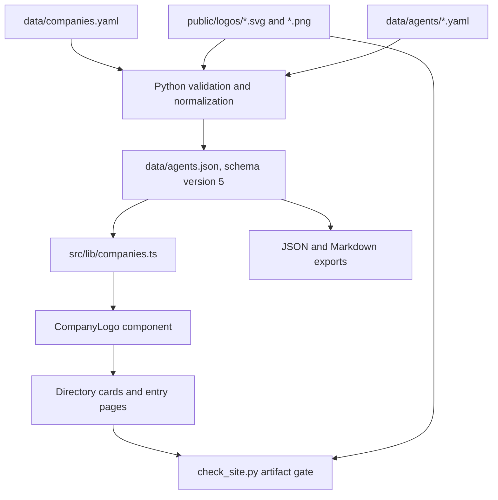

# Plan 007: Show a company logo on every catalog surface

> **Proposal, not implementation authorization.** This plan answers the request to
> show the logo of each organization the catalog names, for example on
> `https://internal-agents.com/agents/airbnb-airchat`. It was prepared against
> commit `e5669d0` on 2026-09-15.
>
> **Executor instructions:** Read the full plan before editing. Do the steps in
> order, keep the evidence contracts, and run the verification gates. Record the
> completion evidence in this file and update `plans/README.md` when the
> implementation is complete. A reviewer can keep ownership of that index.
>
> **Drift check:** Run `git diff --stat e5669d0..HEAD -- scripts data src tests
> docs public vercel.json package.json .claude/skills` and compare the changed
> areas with the current-state excerpts below. Resolve meaningful drift before
> implementation. Do not overwrite the work of another contributor.

## Recommendation

Add **one company registry with vendored logo files**, normalize it into the
catalog JSON, and render every logo through **one Astro component with a
monogram fallback**. Show the logo in gray scale.

The registry holds the organization identity. The logo file lives in the
repository with its own provenance, in the same way the Geist font does. No page
and no build step reads a third-party service.

| Option | Fit for this repository | Decision |
| --- | --- | --- |
| A logo service at run time, such as a favicon or brand API | No asset provenance. It adds an external dependency to every page view, sends the address of each reader to a third party, and breaks the self-contained artifact contract that `scripts/check_site.py` holds. | Rejected. |
| A logo field in each of the 40 record files | The same organization appears in up to three records, so the same asset and the same trademark decision would be written three times and can disagree. | Rejected. |
| One company registry plus vendored assets | One record for each organization. The join is validated in both directions. The asset is in the repository with a source URL, a date, and a hash. | **Recommended.** |

The organization keeps its display name in `data/agents/*.yaml`. The build adds
the company identifier, so no record file changes.

## Status and sizing

- **Priority:** P2
- **Effort:** M. About 2–3 focused engineering days for the code, and separate
  editorial work to collect up to 36 assets. The two can run at the same time.
  This is an estimate, not a delivery commitment.
- **Risk:** Low to medium. The code risk is small. The real risks are the
  trademark posture and assets that cannot be read at a small size in gray scale.
- **Depends on:** Plan 006, complete. This plan uses its catalog, view, and route
  boundaries.
- **Category:** Feature / presentation.
- **Planned at:** `e5669d0`, 2026-09-15.
- **Implementation status:** DONE on 2026-09-15. The code shipped in the step-3 monogram
  state, and the asset collection followed the same day: 33 organizations carry a vendored
  logo, and 3 (HubSpot, Microsoft, Sierra) stay on the monogram because their published
  brand rules do not permit third-party use.

Suggested sequence: build the registry and its gates first, with every company
set to the monogram. Then wire the component into the pages. Then add the assets
in batches. The feature is releasable at each of those points.

## What success means

1. Each directory card and each entry page shows the logo of its organization,
   or a monogram when the catalog holds no logo for it.
2. The logo comes from a file in this repository. The page makes no external
   request for it.
3. Each logo file records where it came from and when it was collected. A change
   to the bytes is visible in review.
4. A missing logo is a normal state, not a broken page. An organization can move
   between the two states with a one-line registry edit.
5. A new organization fails the build until somebody adds its registry record, so
   the two collections cannot drift apart.
6. The public pages state how the catalog uses these trademarks, and how an owner
   can ask for removal.

## Current state and confirmed baseline

The catalog holds 40 approaches across 36 organizations, 578 claims, and 98
sources. `company` is a free text field in each record. It is rendered as plain
text in two places.

Read-only verification on 2026-09-15 passed on a clean tree:

- `uv run --no-sync --locked python -B scripts/build.py --check`: 40 approaches,
  generated files current.
- `uv run --no-sync --locked python -B -m unittest discover -s tests`: 181 tests.

### Files and load-bearing excerpts

`scripts/build.py:739` loads the records. There is no company collection:

```python
def load_agents() -> list[dict]:
    paths = sorted(AGENTS_DIR.glob("*.yaml"))
```

`scripts/build.py:1168` writes the normalized catalog:

```python
return {"schema_version": 4, "approaches": approaches, "claims": claims, "sources": sources}
```

`src/lib/catalog.ts:7` holds the one schema version the website reads, and
`validateCatalog` stops the build on an unresolved reference. Add the company
checks there, in the same style.

`scripts/check_site.py:20` names the published files of `public/` by hand:

```python
PUBLIC_FILES = {"favicon.ico", "og.png", "fonts/Geist.woff2", "fonts/OFL.txt"}
DIRECTORIES = {"_astro", "fonts", "notes", "agents"}
```

`src/components/AgentCard.astro:24` and `src/pages/agents/[id].astro:57` render
the company name:

```astro
<span class="company">{card.company}</span>
<p class="eyebrow">{entry.company} · {entry.approachTypeLabel}</p>
```

`src/styles/components.css:167` styles that text. `src/styles/tokens.css` holds
the tokens and declares `color-scheme: light`, so the site has one theme and
needs one logo variant for each organization.

`scripts/check_private_data.py:31` reads every tracked text file. An SVG is text,
so this gate reads the logo files. A brand asset that carries a contact address
in its metadata fails the gate. Remove the metadata from each asset.

`vercel.json` already sends `X-Content-Type-Options: nosniff` for every path.

## Target architecture



### Ownership boundaries

- Python owns the registry rules, the asset rules, and the derived values.
- The catalog JSON is the only interface between the data and the website.
- Astro owns the component, the layout, and the monogram text.
- No website code reads `data/companies.yaml` or the `public/logos/` directory.

## Data model

Authored registry, `data/companies.yaml`, sorted by identifier:

```yaml
# ABOUTME: The organizations the catalog names, with their logo files and provenance.
# ABOUTME: Each logo is the trademark of its owner and identifies the entry only.
- id: airbnb
  name: Airbnb
  homepage: https://www.airbnb.com/
  logo:
    file: airbnb.svg
    source_url: https://news.airbnb.com/media-assets/
    accessed_at: '2026-09-15'
- id: monday-com
  name: monday.com
  homepage: https://monday.com/
  logo: none
  logo_note: The brand guidelines do not permit use by other parties. The monogram shows instead.
```

- `id` is kebab case and unique. It is also the file name stem of the asset.
- `name` must equal the `company` value of the records, exactly.
- `homepage` identifies the organization for a reader and for later company
  pages. No page renders it today. Keep it, and do not add a link in this plan.
- `logo: none` requires `logo_note`. The note states the reason, for example a
  brand rule, a missing asset, or work that is not done yet.
- `accessed_at` is the date of collection, in the same form as the record dates.

Derived output in `data/agents.json`, schema version 5:

```json
"companies": [
  {
    "id": "airbnb",
    "name": "Airbnb",
    "homepage": "https://www.airbnb.com/",
    "logo": {
      "path": "logos/airbnb.svg",
      "media_type": "image/svg+xml",
      "width": 128,
      "height": 40,
      "bytes": 3184,
      "sha256": "sha256:...",
      "source_url": "https://news.airbnb.com/media-assets/",
      "accessed_at": "2026-09-15"
    }
  }
]
```

Each approach gets `"company_id": "airbnb"`. The website joins on that
identifier, not on the display name.

The build computes `sha256`, `bytes`, `width`, and `height`. It does not read
them from the registry. A change to the asset bytes therefore changes
`data/agents.json`, and `scripts/build.py --check` fails until the change is
committed. The change is then visible in the pull request. This gives the same
protection as an authored hash, with nothing to keep in agreement by hand.

## Implementation steps

### 1. Registry and validation in `scripts/build.py`

Add a `load_companies()` function beside `load_agents()`, and a
`normalize_companies()` function beside `normalize()`. Keep them in `build.py`.
The addition is about 160 lines, and a new module is not justified for that.

Validate, and stop the build with the existing `die()` on any failure:

1. The file parses, holds a list of mappings, and is sorted by `id`.
2. `id` matches `^[a-z0-9]+(?:-[a-z0-9]+)*$` and is unique. `name` is unique.
3. Only the documented keys are present. `id`, `name`, `homepage`, and `logo`
   are required.
4. `homepage` and `source_url` use HTTPS.
5. Each `company` value in `data/agents/` resolves to one record, and each
   record is used by at least one approach. Name both failures with the file
   that holds them.
6. `logo: none` carries a non-empty `logo_note`.
7. The asset exists at `public/logos/<file>`, its stem equals `id`, and its
   extension is `.svg` or `.png`.
8. `public/logos/` holds no file that the registry does not name.
9. An SVG is at most 64 KiB. A PNG is at most 128 KiB and at least 128 pixels
   wide.
10. An SVG passes a safety check: no `<!DOCTYPE` and no `<!ENTITY`, no `script`
    or `foreignObject` element, no attribute that starts with `on`, no
    `javascript:` value, and no `href` or `xlink:href` outside a local fragment.
    The pages serve the asset with ``, so a script in the file cannot run
    in the page. This check is a second barrier, not the only one.
11. The intrinsic size comes from the SVG `viewBox`, or from the PNG header.
    A file without a usable size fails, because the page needs the size to
    reserve the space.

Use the standard library for both formats. `xml.etree.ElementTree` reads the
SVG, and `struct` reads the 24 header bytes of the PNG. Do not add an image
dependency.

Print a summary line at the end of the build, for example
`40 approaches, 36 organizations, 21 logos, 15 monograms.` This keeps the
remaining work visible in every build.

### 2. Bump the catalog schema to version 5

Add `companies` to the normalized output, add `company_id` to each approach, and
change the version number in `scripts/build.py:1168` and
`src/lib/catalog.ts:7`. Update `tests/test_check_site.py:30` and
`tests/web/catalog.test.ts`. Record the change in `data/schema.md` and in
`src/pages/data-guide.md.ts` content, because the exports describe the schema to
outside readers. Keep every claim, source, and approach identifier unchanged.

### 3. Seed the registry

Write all 36 records with `logo: none` and a note. The build then passes, and the
site shows a monogram everywhere. This separates the code change from the asset
work and makes the first release small.

### 4. Website rendering

Add `src/lib/companies.ts` with the validation style of `src/lib/catalog.ts`:

- `companiesById(catalog)` and `requireCompany(catalog, id)`.
- `monogram(name)`: take the first character of each of the first two words that
  start with a letter or a digit, and put them in upper case. `Airbnb` gives
  `A`, `Y Combinator` gives `YC`, `monday.com` gives `M`.
- `companyView(catalog, companyId)` returns the name, the monogram, and the
  logo source and size, or `null` for the logo.

Add `src/components/CompanyLogo.astro` with a `size` property:

```astro
<span class="company-logo" data-company-id={company.id}>
  {company.logo ? (
    
  ) : (
    <span class="company-logo-monogram" aria-hidden="true">{company.monogram}</span>
  )}
</span>
```

Use it in `AgentCard.astro` beside `.company` at 20 px, and in
`agents/[id].astro` above the eyebrow at 40 px. The directory holds 40 cards, so
its logos load lazily. The entry page holds one, which loads eagerly.

Add `.company-logo` to `src/styles/components.css`:

- A box with a fixed height and `max-width: calc(4 * height)`.
- `img { height: 100%; width: auto; max-width: 100%; object-fit: contain; }`.
- `filter: grayscale(1);` in all states. There is no color change on hover.
- The monogram uses `var(--surface)` behind `var(--ink)`, in a square box with
  the same height and a 3 px radius, as the `.tag` style does.

The logo is decorative. `alt` stays empty, and the company name stays beside it
as text. This keeps the reading order correct, and it keeps the text coverage
checks in `scripts/check_site.py` unchanged.

### 5. Asset rules for the editorial work

- Take the asset from the brand, press, or media page of the organization. Do not
  take it from a logo aggregator, a search result, or a screen capture.
- Choose the dark or full color version for a white background. Never choose a
  white version. The site has one light theme, and gray scale keeps the original
  lightness, so a white asset becomes invisible.
- Prefer SVG. Use PNG only when the organization publishes no vector asset.
- Remove the metadata, comments, and unused definitions from the file.
- Record the exact page that published the asset in `source_url`.
- If the brand rules do not permit use, keep `logo: none` and write the reason.

### 6. Artifact and delivery gates

In `scripts/check_site.py`: add `logos` to `DIRECTORIES`, and build the expected
logo names from the `companies` collection of the catalog that the checker
already reads. Do not add the names to `PUBLIC_FILES` by hand. The existing
boundary checks then report a missing asset and an unexpected asset without new
code.

In `scripts/check_delivery.py`: add one asset case for a published logo, so a
wrong content type on the host is caught.

### 7. Trademark statement

Add a section to `METHODOLOGY_SECTIONS` in `src/lib/guide-content.ts`, with the
identifier `logos` and the heading `How we use company logos`. The HTML page and
the Markdown export then carry the same text. State four things:

1. Each logo is the trademark of its owner.
2. The catalog shows it to identify the organization of an entry. It does not
   show an endorsement, a partnership, or a review of the organization.
3. An owner can ask for removal. The entry then shows a monogram, and the entry
   itself does not change.
4. A logo says nothing about the evidence. It is not a quality signal.

Repeat point 1 and point 3 in the header comment of `data/companies.yaml`.

### 8. Documentation and contribution flow

- `data/schema.md`: a section for the registry and the derived company output.
- `docs/site.md`: the logo rules, the gray scale decision, and the asset rules.
- `.claude/skills/add-agent-from-url/SKILL.md`: one step that says to add a
  registry record when the organization is new, and to use `logo: none` with a
  reason when the asset is not available.
- `CONTRIBUTING.md`: where a contributor puts a new asset.

## Verification gates

Run `npm run verify`. It holds every gate this change touches. Run these first
during development:

- `uv run --locked python scripts/build.py --check`
- `uv run --locked python -m unittest discover -s tests`
- `npm run check && npm run test:unit`
- `npm run build && uv run --locked python scripts/check_site.py --root dist`
- `uv run --locked python scripts/check_private_data.py`

New tests:

- `tests/test_build.py`: an unknown company name, an unused registry record, a
  missing asset, a duplicate identifier, an unsafe SVG, an oversized asset, an
  asset without a usable size, a `logo: none` record without a note, and the
  derived hash, bytes, and size values.
- `tests/test_check_site.py`: a published logo passes, a missing logo fails, and
  an unexpected file in `dist/logos/` fails.
- `tests/web/companies.test.ts`: the monogram rule, the view, and an unresolved
  `company_id`.
- `tests/web/catalog.test.ts`: schema version 5 and the company validation.
- `tests/e2e/directory.spec.ts` and `tests/e2e/entry-pages.spec.ts`: one entry
  with a logo shows the image with the expected source, and one entry without a
  logo shows the monogram. The preview test writes screenshots as artifacts and
  compares nothing, so it needs no new baseline.

## Done criteria

- [x] `npm run verify` passes in a fresh checkout. (Passed in the working tree on
  2026-09-15; the tree also holds unrelated in-progress edits from another
  contributor, which the gates accept.)
- [x] Each of the 36 organizations has one registry record, and the build fails
  when a record or a company name has no partner.
  (`tests/test_build.py::test_company_registry_must_join_both_ways`.)
- [x] Each directory card and each entry page shows a logo or a monogram.
  (Monogram everywhere in this release; e2e `company marks` specs follow the
  catalog, so a future logo flips them without an edit.)
- [x] No published page requests an external image. (The mark component reads
  only `/logos/...`; `check_site.py` resolves every local asset target and the
  boundary check rejects files the catalog does not name.)
- [x] `data/agents.json` is schema version 5, holds the company collection, and
  keeps every existing claim, source, and approach identifier. (Approach, claim,
  and source identifier sets compared unchanged against the previous catalog.)
- [x] The artifact gate derives the expected logo files from the catalog and
  rejects a missing or an unexpected asset.
  (`tests/test_check_site.py::test_a_published_logo_passes_and_a_missing_logo_fails`,
  `test_an_unexpected_file_in_the_logo_directory_fails`.)
- [x] The Methodology guide and its Markdown export carry the trademark
  statement and the removal statement. (Section `logos` in
  `METHODOLOGY_SECTIONS`; `tests/web/guides.test.ts` holds page/export parity.)
- [x] Each vendored asset records its source page and its collection date, and
  carries no contact data. (All 33 records carry `source_url` and
  `accessed_at: '2026-09-15'`; `check_private_data.py` passes over every file.)
- [x] A design review confirms that each published logo is readable in gray
  scale at 20 px, and that the cards keep their quiet appearance. (Every mark
  reviewed in gray scale at 20 px and 40 px on the contact sheet
  `/tmp/plan007-logos/design-review.png`, generated from the catalog on
  2026-09-15; no white-only asset survived, and compact marks were preferred
  over long lockups throughout.)
- [x] `plans/README.md` and the documents in step 8 describe the final state.

## Completion evidence (2026-09-15)

Implemented against the working tree on top of `e5669d0`. The drift check found
no committed change in the touched areas. A concurrent contributor refreshed 15
record summaries and review dates in the same tree; those edits are content
only, no `company` value changed, and they are preserved.

- **Registry and validation**: `load_companies()` and `normalize_companies()` in
  `scripts/build.py` hold all eleven checks of step 1, including the SVG safety
  scan (`xml.etree.ElementTree`), the PNG header read (`struct`), and the
  both-ways join that names the offending file. The build summary line prints
  `40 approaches, 36 organizations, 0 logos, 36 monograms.`
- **Schema 5**: `data/agents.json` carries `companies` and per-approach
  `company_id`; `src/lib/catalog.ts` validates the company joins in the
  existing `validateCatalog` style. `tests/test_check_site.py` and
  `tests/web/catalog.test.ts` moved to version 5.
- **Seed**: all 36 records in `data/companies.yaml` use `logo: none` with the
  note `No logo asset has been collected yet. The monogram shows instead.`
  Homepages come from each organization's own domains.
- **Rendering**: `src/lib/companies.ts` (monogram, views, lookups) and
  `src/components/CompanyLogo.astro` (decorative mark, `--logo-size`, lazy on
  cards at 20 px, eager on entry pages at 40 px). `src/styles/components.css`
  adds the gray-scale image rules and the monogram tile. The company name stays
  beside the mark as text.
- **Gates**: `check_site.py` allows `dist/logos/` and derives its expected
  contents from the catalog; `check_delivery.py` adds `logo_cases()` and the
  SVG/PNG media types.
- **Trademark**: section `logos` in `METHODOLOGY_SECTIONS` states the four
  required points; the header comment of `data/companies.yaml` repeats the
  trademark ownership and the removal request.
- **Docs**: `data/schema.md` (Company registry section), `docs/site.md`
  (Company logos subsection), `CONTRIBUTING.md` (Add a company logo),
  `.claude/skills/add-agent-from-url/SKILL.md` (new-organization step),
  `templates/data-guide.md` (companies collection and `company_id` join).
- **Tests added**: 11 registry and asset tests in `tests/test_build.py`; 2 logo
  boundary tests in `tests/test_check_site.py`; 1 delivery logo test; company
  validation cases in `tests/web/catalog.test.ts`; `tests/web/companies.test.ts`
  (monogram, views, unresolved identifier); logo/monogram acceptance in both
  e2e specs, derived from the catalog. `tests/web/e2e-paths.test.ts` now scopes
  its screenshot-path rule to `screenshot(...)` calls, because the specs also
  declare catalog `logo.path` types.
- **Gates run**: `uv run --locked python scripts/build.py --check`,
  `uv run --locked python -m unittest discover -s tests` (194 tests),
  `npm run check`, `npm run test:unit`, `npm run build`,
  `uv run --locked python scripts/check_site.py --root dist`,
  `uv run --locked python scripts/check_private_data.py`, ruff check and
  format, and the full `npm run verify`.

Deferred to the editorial phase, with the rules already in place: collecting
the assets themselves from each organization's brand or press page, and the
20 px gray-scale design review that comes with them.

## Asset collection record (2026-09-15)

Nine collector agents researched each organization's own brand, press, or media
surface and staged candidates under `/tmp`; the integration step then validated
every file with the build's own checks before vendoring. Nothing was taken
from an aggregator, a search thumbnail, or a capture.

- **33 logos vendored** into `public/logos/` (29 SVG, 4 PNG: Cloudflare press
  kit, Coinbase and DoorDash official GitHub organization avatars, StrongDM
  docs navbar, Uber developer design-guidelines PNG). Each registry record
  carries the exact publishing page in `source_url` and
  `accessed_at: '2026-09-15'`. Compact marks were preferred over long lockups
  (Atlassian A, Salesforce no-type cloud, Shopify bag, Replit symbol, Retool
  icon, Spotify icon, WorkOS logomark); monday.com keeps its full wordmark
  because its brand rules require the complete text.
- **3 monograms by brand rule**: HubSpot and Microsoft publish trademark
  guidelines that do not permit third-party website use without written
  permission or an express license; Sierra's brand page requires written
  authorization for any use. Their `logo_note` records the reason.
- Two collection notes for the record: Zup's CloudFront refuses non-browser
  clients, so the exact org-published bytes came from the Wayback snapshot of
  zup.com.br's own header asset; Sentry's branding page generates downloads
  client-side, so the glyph path data and its published dark color were saved
  as a standalone SVG. Both trace to the organization's own publication.
- The gray-scale readability review ran over the full contact sheet (all 36
  organizations at 20 px and 40 px in gray scale): every mark reads, and the
  sheet is kept at `/tmp/plan007-logos/design-review.png` for sign-off.
- The full `npm run verify` gate passed after the collection, with the e2e
  logo branches now live against 33 real logos (the dormant catalog-derived
  loops from the code phase activated without an edit, as designed).

A four-lens adversarial review (spec, Python, web, tests) with independent
verification of each finding ran after the gates passed. It found no blockers.
Four minor findings were fixed: the Plan 006 continuation lines in
`plans/README.md` are back under their own bullet, the directory e2e spec now
carries the dormant logo-image branch beside its monogram branch,
`validateCatalog` reports a non-object company entry with a `fail()` message
instead of a `TypeError`, and `svg_logo_size` rejects a non-finite viewBox with
`die()` instead of an uncaught `ValueError`. The review also tightened the
registry tests: the file-extension rule is isolated, both join failures assert
their file-naming messages, and the PNG 128 KiB limit has a test.

## Stop conditions

Pause the affected step and report the evidence if:

- Two organizations need the same display name, or a name changes, so the join
  on `company` cannot stay exact. Resolve the identity model, for example with an
  authored `company_id` in the records, before you render anything.
- An asset cannot be collected under clear terms from the organization itself.
  Keep `logo: none` and the reason. Do not take the asset from another source.
- A logo is not readable in gray scale at 20 px. Keep the monogram for that
  organization. Do not add a per-company visual exception, such as a colored
  tile or an outline, without a design decision.
- The asset checks appear to need a new image dependency. Reduce the check
  instead, and record what is no longer covered.
- The schema change appears to break an export contract beyond the version bump.
- An owner asks for removal during the work. Apply the `logo: none` state first,
  then continue.

## Maintenance notes and deferred work

Keep the logo out of the evidence model. It identifies an organization and
supports no claim. Never let it change a confidence value, an evidence strength,
or the order of the directory.

Keep the registry small. It holds identity and asset provenance, and nothing
about the systems the organization builds.

Deferred, with the same boundaries: company pages at `/companies/<id>` that
group the approaches of one organization and use `homepage`; per-entry social
images that hold the logo; a dark version of each asset, needed only when the
site gains a second theme; and a split of the asset validation into its own
module if it grows past the size of one readable section of `scripts/build.py`.
